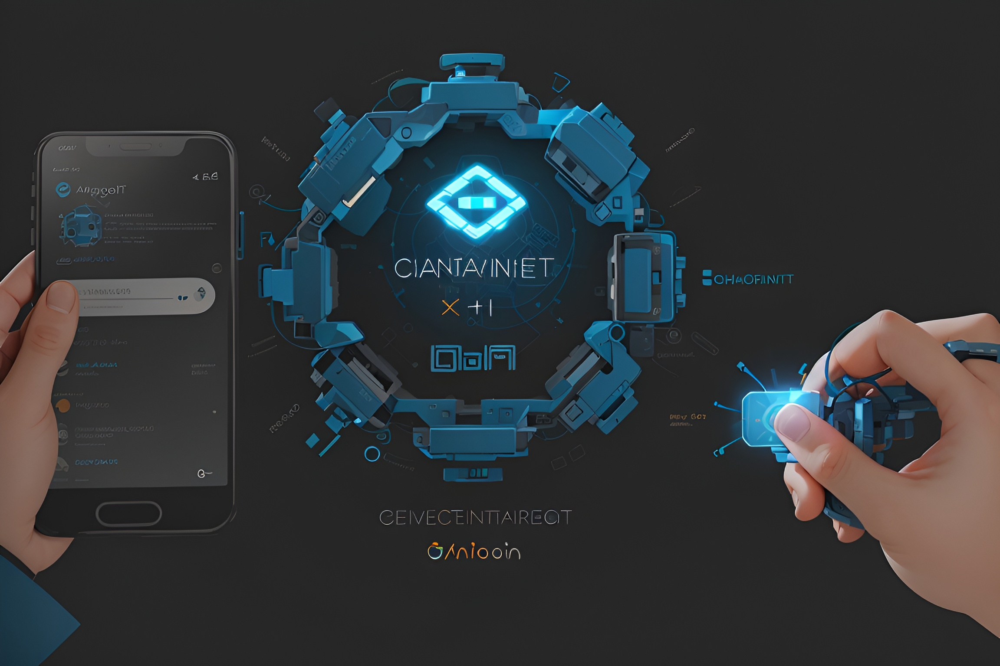
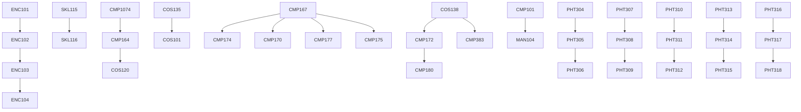
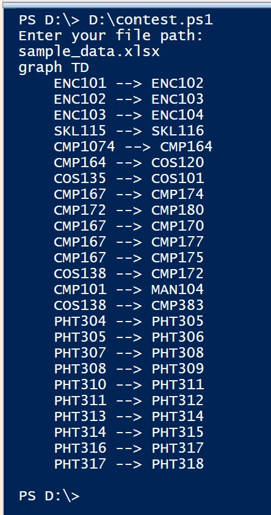

# 🏆 Cuộc Thi Phát Triển Ứng Dụng với Generative AI của YouthDev 2023
YouthDev-ADGAIC-2023



## 🚀 Tổng Quan Cuộc Thi

Chào mừng đến với Cuộc thi Phát Triển Ứng Dụng với Generative AI! Cuộc thi này thách thức các thí sinh phát triển các **ứng dụng đột phá** sử dụng kỹ thuật Generative AI. Hãy thể hiện kỹ năng của bạn và sự sáng tạo trong việc xây dựng các ứng dụng dựa trên trí tuệ nhân tạo.

## 📝 Chi Tiết Cuộc Thi
- **Đối tượng tham gia**: ***Tất cả sinh viên HUTECH*** thuộc tất cả các Khoa Viện đều có thể tham gia.
- **Mục tiêu**: Phát triển một ứng dụng ***(không chỉ là các thông điệp chat)*** sử dụng kỹ thuật Generative AI để tạo ra các kết quả độc đáo và mới mẻ.
- **Ngôn ngữ lập trình**: Thí sinh có thể sử dụng ***bất kỳ ngôn ngữ lập trình hoặc framework nào*** mà họ chọn.
- **Dữ liệu mẫu**: Chúng tôi cung cấp dữ liệu mẫu để kiểm tra như bên dưới.
- **Thời hạn**: Thí sinh cần nộp bài trước thời điểm ***hết ngày 30/07/2023 theo giờ Việt Nam (23:59 GMT+7).***

## 💡 Hướng Dẫn Cuộc Thi

Thí sinh cần tuân theo các hướng dẫn sau đây:

- Thí sinh phải tuân thủ các quy định đạo đức và tránh sử dụng nội dung xúc phạm hoặc có hại.
- Bài nộp phải bao gồm:
  1. Một **ứng dụng hoạt động** (file .zip).
  2. Một **tài liệu tóm tắt** mô tả ứng dụng (file .pdf).
  3. **Liên kết chia sẻ** (ví dụ: https://chat.openai.com/share/ee4ccbfd-699b-4e0d-a6e4-a427417d1d04).
- Hãy đảm bảo mã nguồn của bạn có cấu trúc tốt, được tài liệu hóa và tuân thủ các best practices.
- Tất cả bài nộp sẽ được đánh giá dựa trên tính sáng tạo, tính năng và trải nghiệm tổng thể cho người dùng.

## 🎯 Nhiệm Vụ Cuộc Thi

Thí sinh cần hoàn thành các nhiệm vụ sau:

1. Sử dụng công cụ Generative AI, như ***ChatGPT***, để tạo ra một ứng dụng có thể đọc và viết mã Mermaid.
2. Yêu cầu mô hình Generative AI lập trình một ứng dụng ***có thể chỉ dùng console***.
3. Lập trình khả năng của ứng dụng cho phép ***tạo ra các biểu đồ Mermaid*** độc đáo dựa trên đầu vào từ người dùng (từ tập tin Excel/PDF).
4. Viết tài liệu mô tả ứng dụng, các tính năng và quy trình tạo ra các biểu đồ Mermaid.
5. Nộp tài liệu mô tả ứng dụng cùng với source code ứng dụng.

## 📂 Tệp Mẫu và Kết Quả Mục Tiêu

- Chúng tôi cung cấp các tệp mẫu sau để đưa vào và kiểm tra ứng dụng của bạn:
  - [Tệp Excel Mẫu](./sample_data.xlsx)
  -

 [Tệp PDF Mẫu](./sample_data.pdf)
- Kết quả mục tiêu ví dụ:
  - [Kết quả mục tiêu mẫu](./sample_target_result.pdf)
  - Ví dụ này được cung cấp chỉ nhằm mục đích minh họa. Kết quả mục tiêu thực tế sẽ được đánh giá dựa trên tiêu chí cuộc thi.

```
graph TD
    ENC101 --> ENC102
    ENC102 --> ENC103
    ENC103 --> ENC104
    SKL115 --> SKL116
    CMP1074 --> CMP164
    CMP164 --> COS120
    COS135 --> COS101
    CMP167 --> CMP174
    CMP172 --> CMP180
    CMP167 --> CMP170
    CMP167 --> CMP177
    CMP167 --> CMP175
    COS138 --> CMP172
    CMP101 --> MAN104
    COS138 --> CMP383
    PHT304 --> PHT305
    PHT305 --> PHT306
    PHT307 --> PHT308
    PHT308 --> PHT309
    PHT310 --> PHT311
    PHT311 --> PHT312
    PHT313 --> PHT314
    PHT314 --> PHT315
    PHT316 --> PHT317
    PHT317 --> PHT318
```



- Kết quả ứng dụng console ví dụ:
[](sample_console_application_output.jpg)
  
## 🏅 Giải Thưởng

- Giải Nhất: 500,000 VND
- Giải Nhì: 400,000 VND
- Giải Ba (Vị trí thứ 3): 300,000 VND
- Giải Ba (Vị trí thứ 4): 200,000 VND

## 📬 Nộp Bài

Để tham gia cuộc thi, thí sinh làm theo các bước sau:

1. Phát triển ***ứng dụng*** và tạo một ***tệp tài liệu*** mô tả ứng dụng và quy trình tạo ra các biểu đồ Mermaid.
2. Gói tất cả mã nguồn của ứng dụng và tệp tài liệu vào một ***tệp zip duy nhất***. *Không chứa các folder packages, node_module hoặc các thư viện.*
3. Tải tệp zip lên và chia sẻ liên kết ChatGPT sử dụng ***Google Form cung cấp***: [Google Form Nộp Bài](https://forms.gle/Dv7qbswr1i4TxGnT8). (Vui lòng đảm bảo dung lượng tệp dưới 100MB.)
4. Nộp biểu mẫu trước thời điểm **hết ngày 30/07/2023 theo giờ Việt Nam (23:59 GMT+7)**.

## ❓ Câu Hỏi và Hỗ Trợ

Tham gia Group Zalo: https://zalo.me/g/dyqsii775

Đối với bất kỳ câu hỏi hoặc hỗ trợ nào liên quan đến cuộc thi, vui lòng liên hệ chúng tôi qua bm.toan@hutech.edu.vn hoặc truy cập https://www.facebook.com/groups/clbhutechyouthdev.

Hãy tham gia ngay và thể hiện kỹ năng trong việc phát triển ứng dụng với Generative AI!


